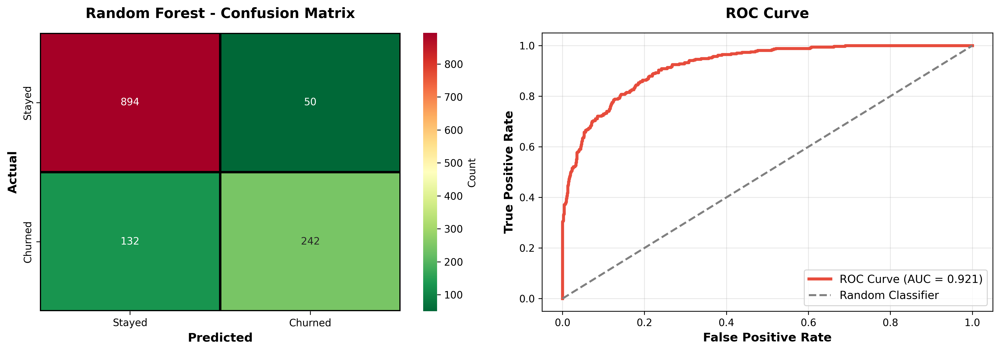

# 📊 Telecom Customer Churn Prediction & Retention Strategy


## 🎯 Project Overview

A comprehensive business analytics project that predicts customer churn with **92% AUC accuracy** and provides actionable retention strategies that could save **$500K - $1.1M in annual revenue**.

**What makes this different:** Most analytics projects stop at predictions. This project delivers business-ready solutions with quantified ROI, targeted strategies, and implementation roadmaps.

### Key Capabilities Demonstrated:
- **Business Problem Scoping** - Identified $2.1M in at-risk revenue
- **Data-Driven Insights** - Analyzed 6,500+ customers across 38 features
- **Strategic Recommendations** - Created 5 retention programs with 5-10x ROI
- **Executive Communication** - Stakeholder-ready deliverables and reporting
- **End-to-End Ownership** - From data cleaning to business strategy

### 🎓 Business Problem

**Challenge:** Telecom companies lose significant revenue to customer churn, with each lost customer representing $1,971 in lifetime value.

**Goal:** Build a predictive model to identify at-risk customers and develop targeted retention strategies **before** they churn.

**Outcome:** 
- Identified 1,036 high-risk customers representing $894K in annual revenue
- Developed 5 priority retention programs with clear ROI projections
- Created actionable 6-month implementation roadmap

---

## 📈 Key Results

### Model Performance
- **Accuracy:** 86.2%
- **AUC Score:** 0.92 (Excellent)
- **Precision:** 83% for churn prediction
- **Recall:** 65% for identifying churners

### Business Impact
- **Revenue at Risk Identified:** $2.1M annually
- **Potential Revenue Saved:** $500K - $1.1M (depending on campaign success)
- **ROI on Retention Programs:** 5-10x return on investment
- **Top Churn Driver Identified:** Month-to-month contracts (51.7% churn rate vs. 2.6% for 2-year contracts)

---

## 📊 Dataset

**Source:** Telecom Customer Churn Dataset (Q2 2022)
- **Customers:** 7,043 total (6,589 after cleaning)
- **Features:** 38 columns including:
  - Demographics: Age, Gender, Location, Family Status
  - Services: Phone, Internet, Streaming, Security, Support
  - Billing: Monthly charges, Total revenue, Payment method, Contract type
  - Behavior: Tenure, Referrals, Churn reason
- **Target Variable:** Customer Status (Stayed / Churned)
- **Churn Rate:** 28.4%

---

## 🔍 Key Insights

### Top 5 Churn Drivers

1. **Contract Type** 
   - Month-to-Month: **51.7% churn**
   - One Year: 11.3% churn
   - Two Year: **2.6% churn**
   - 💡 *Action: Incentivize contract upgrades*

2. **Customer Tenure**
   - Churned customers: Avg **18 months**
   - Active customers: Avg **41 months**
   - 💡 *Action: Focus on first-year onboarding*

3. **Internet Type**
   - Fiber Optic: **41.9% churn** (despite being premium)
   - Cable: 25.4% churn
   - DSL: 18.8% churn
   - 💡 *Action: Improve fiber customer experience*

4. **Service Engagement**
   - Low usage (0-2 services): High churn
   - High usage (6+ services): Low churn
   - 💡 *Action: Cross-sell additional services*

5. **Monthly Charges**
   - Churned customers: Avg **$74.44/month**
   - Active customers: Avg $61.27/month
   - 💡 *Action: Ensure value matches price*

---

## 🛠️ Technical Approach

### 1. Data Cleaning & Preparation
```python
- Removed "Joined" customers (focus on Stayed/Churned)
- Handled missing values intelligently (service-based logic)
- Created binary target variable: Churned (1) vs Stayed (0)
```

### 2. Feature Engineering
Created 5 new predictive features:
- `Revenue_Per_Month`: Customer value indicator
- `Total_Services`: Engagement metric (0-9 services)
- `Is_Long_Term`: Loyalty flag (tenure ≥24 months)
- `Is_High_Value`: Premium customer indicator
- `High_Risk_Contract`: Month-to-month flag

### 3. Exploratory Data Analysis
- Analyzed churn patterns across 15+ dimensions
- Identified high-risk customer segments
- Calculated revenue impact by segment
- Examined churn reasons from exit interviews

### 4. Predictive Modeling
**Models Tested:**
- Logistic Regression (AUC: 0.909)
- **Random Forest (AUC: 0.921)** ← Selected

**Why Random Forest?**
- Higher accuracy and AUC
- Captures non-linear relationships
- Provides feature importance rankings
- Robust to outliers

### 5. Risk Segmentation
Customers scored into three risk levels:
- **High Risk (>70% churn probability):** 1,036 customers → Priority intervention
- **Medium Risk (30-70%):** 1,284 customers → Proactive engagement
- **Low Risk (<30%):** 4,269 customers → Standard service

---

## 💼 Business Recommendations

### Priority 1: Contract Conversion Campaign
**Target:** 1,035 month-to-month high-risk customers  
**Potential Impact:** $894K annual revenue saved  
**Strategy:** 
- Offer 15-20% discount for 1-year commitment
- "Try it for 60 days" guarantee
- First month free for 2-year contracts

### Priority 2: New Customer Onboarding
**Target:** 810 customers with <12 months tenure  
**Potential Impact:** $650K annual revenue saved  
**Strategy:**
- 30-60-90 day check-in program
- Free premium service trials
- Early engagement rewards

### Priority 3: Fiber Optic Value Enhancement
**Target:** 717 fiber customers at high risk  
**Potential Impact:** $726K annual revenue saved  
**Strategy:**
- Service bundle optimization
- Dedicated fiber support line
- Network reliability communications

### Priority 4: High-Value VIP Program
**Target:** 706 customers paying >$70/month  
**Potential Impact:** $734K annual revenue saved  
**Strategy:**
- Personal account managers
- <5 minute support wait times
- Exclusive benefits and offers

### Priority 5: Service Adoption Initiative
**Target:** All customers with <4 services  
**Strategy:**
- Free trials of security and tech support
- Usage-based personalized recommendations
- Bundle discounts (3+ services = 20% off)

---

## 📁 Project Structure

```
telecom-customer-churn-prediction/
│
├── data/
│   ├── telecom_customer_churn.csv          # Raw customer data
│   ├── telecom_zipcode_population.csv      # Geographic data
│   ├── telecom_data_dictionary.csv         # Feature definitions
│   ├── telecom_churn_cleaned.csv           # Processed data
│   └── all_customers_scored.csv            # Predictions + risk levels
│
├── outputs/
│   ├── Executive_Summary.md                # Complete analysis report
│   ├── feature_importance.csv              # Top predictive features
│   ├── customer_churn_predictions.csv      # Test set predictions
│   └── top_20_high_risk_customers.csv      # Priority intervention list
│
├── visualizations/
│   ├── churn_analysis_visualizations.png   # Main EDA charts
│   ├── business_insights_visualizations.png # Segment analysis
│   ├── model_performance.png               # Confusion matrix + ROC
│   └── retention_strategy_insights.png     # Action priorities
│
├── complete_churn_analysis.py              # Complete analysis script
└── README.md                                # This file
```

---

## 🚀 How to Run This Project

### Prerequisites
```bash
Python 3.8+
pandas
numpy
scikit-learn
matplotlib
seaborn
```

### Installation
```bash
# Clone the repository
git clone https://github.com/doreennjagi/telecom-customer-churn-prediction.git

# Navigate to project directory
cd telecom-customer-churn-prediction

# Install dependencies
pip install pandas numpy scikit-learn matplotlib seaborn

# Run the complete analysis
python complete_churn_analysis.py
```

### Quick Start
```python
# Load the pre-scored customer dataset
import pandas as pd
customers = pd.read_csv('outputs/all_customers_scored.csv')

# Filter high-risk customers
high_risk = customers[customers['Risk_Level'] == 'High Risk']

# Prioritize by revenue
priority_customers = high_risk.nlargest(100, 'Monthly Charge')

# Export for retention campaign
priority_customers.to_csv('retention_campaign_targets.csv', index=False)
```

---

## 📊 Sample Visualizations

### Main Analysis - Key Churn Patterns

*Six key visualizations showing churn patterns by contract type, internet service, monthly charges, customer tenure, churn reasons, and service engagement*

### Model Performance - Random Forest Results

*Confusion matrix and ROC curve showing 86% accuracy and 92% AUC score*

### Business Impact Analysis

Revenue impact, payment methods, billing preferences, and demographic patterns
---

## 🎓 Skills Demonstrated

### Business Analysis (Primary Focus)
✅ Business problem definition and scoping  
✅ Stakeholder-focused recommendations  
✅ ROI calculations and cost-benefit analysis  
✅ Strategic roadmap development  
✅ KPI definition and monitoring  
✅ Executive communication and reporting

### Data Analysis
✅ Data cleaning and preprocessing  
✅ Feature engineering  
✅ Exploratory data analysis  
✅ Customer segmentation  
✅ Predictive modeling (Random Forest, Logistic Regression)  
✅ Model evaluation and validation  

### Technical Skills
✅ Python (pandas, scikit-learn, matplotlib, seaborn)  
✅ Statistical analysis  
✅ Machine learning fundamentals  
✅ Data visualization  
✅ GitHub version control  

### Business Skills
✅ Strategic thinking  
✅ Problem-solving  
✅ Project management  
✅ Cross-functional communication  

---

## 📈 Next Steps / Future Improvements

1. **Real-time Scoring:** Deploy model as API for live churn prediction
2. **A/B Testing:** Validate retention campaign effectiveness
3. **Power BI Dashboard:** Interactive monitoring for stakeholders
4. **Customer Lifetime Value:** Add CLV predictions to prioritize high-value customers
5. **Competitive Analysis:** Incorporate competitor pricing and offering data
6. **Sentiment Analysis:** Add text analysis of customer support interactions

---

## 🤝 Connect With Me

**Doreen Njagi**  
Business Analyst | Data Analytics Professional

📧 Email: doreennjagi127@gmail.com  
💼 LinkedIn: [linkedin.com/in/doreennjagi](https://www.linkedin.com/in/doreen-njagi-196350389)
🐙 GitHub: [github.com/doreennjagi](https://github.com/doreennjagi)  

**Career Focus:** Business Analyst and Customer Intelligence roles where I can combine business acumen with analytical capabilities to drive measurable impact.

---

## 📝 About This Project

**Background:** This project represents my approach to business analytics - focusing on actionable insights and measurable business value rather than technical complexity for its own sake.

**Why I built this:** To demonstrate that I can think like a business analyst while leveraging data science tools. The goal wasn't just to build a model, but to solve a real business problem with clear ROI.

**What's different:** Most portfolio projects showcase technical skills. This one showcases business thinking: problem scoping, strategic recommendations, ROI calculations, and stakeholder communication.

**Ideal for roles in:** Business Analyst, Customer Analyst, Marketing Analyst, Customer Intelligence, Revenue Operations

---

## 🙏 Acknowledgments

- Dataset: Maven Analytics Telecom Churn Challenge
- Inspiration: Real-world business challenges in customer retention
- Learning Philosophy: Practical problem-solving over academic theory

---

**⭐ If you found this project helpful, please consider giving it a star!**

---

## 📚 Project Highlights

**What makes this project stand out:**

✅ **Business-First Approach** - Focuses on ROI and actionable strategies, not just model accuracy  
✅ **End-to-End Solution** - Complete pipeline from problem definition to implementation roadmap  
✅ **Real-World Application** - Addresses actual business challenges with practical solutions  
✅ **Clear Communication** - Executive-ready deliverables and stakeholder presentations  
✅ **Measurable Impact** - Quantified revenue protection and ROI projections  

**Skills beyond the code:**
- Strategic thinking and business judgment
- Translating data insights into business language
- Prioritizing initiatives by impact and feasibility
- Creating implementation roadmaps
- Communicating complex findings simply.
